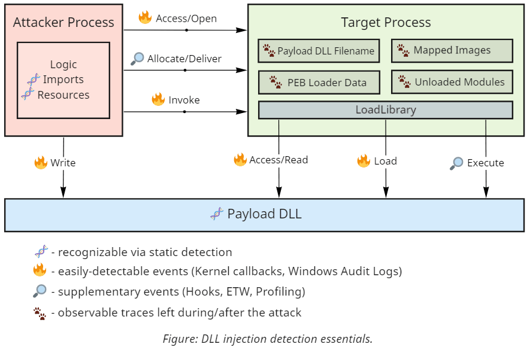
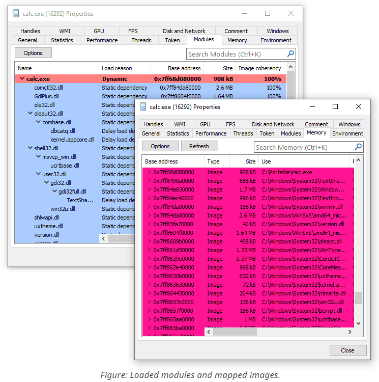
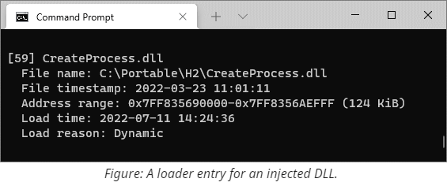
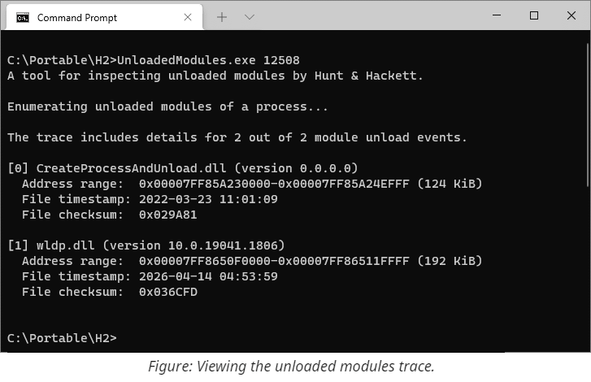
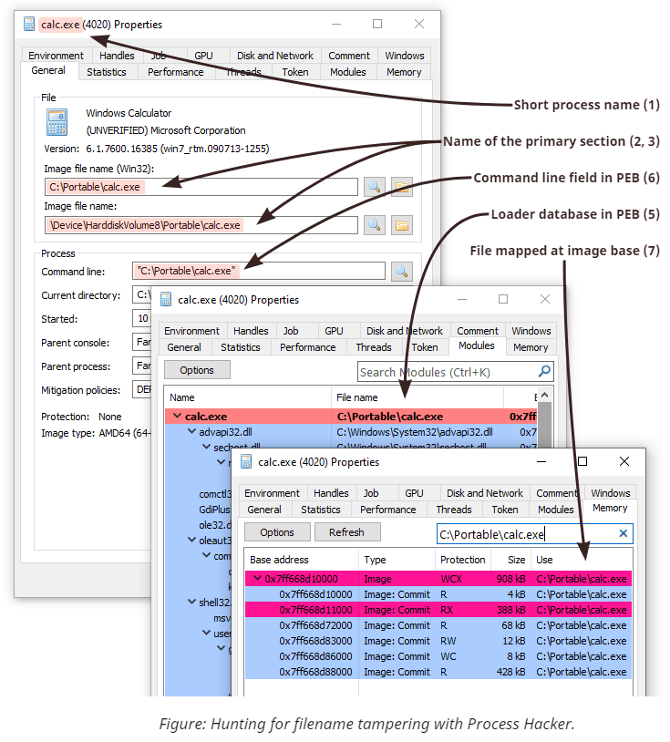
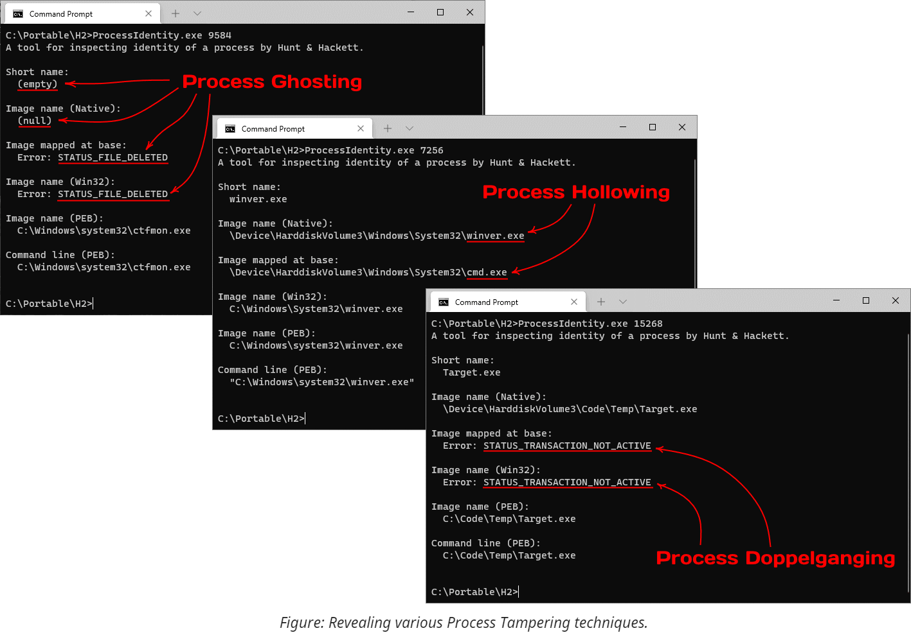

# Detection

The techniques for **concealing code execution** that we discussed in the offensive ([[1]](../Injection), [[2]](../Tampering)) parts of the project have a shared primary objective: they are designed to **fool security software** and **bypass security policies**. Identifying something that actively hides its presence can prove challenging because of the inherent limitations it imposes on the detection methods. Luckily for defenders, most evasion techniques share common flaws that allow hunting for their entire families. Just keep in mind that the traces they leave on the system are often overlooked by antiviruses and might require using custom tooling.

Here is a high-level overview of the topics covered in this write-up:
1. **Static detection**
2. **Runtime detection**
3. **Forensic detection**

# Static Detection

**Signature-based** detection provides a decent starting point because it can recognize known malware and its variations by looking for **shared patterns**. The primary advantage of using this approach is that the analysis can be performed before execution and, thus, is suitable for providing the first echelon of defense. Of course, signature-based detection works best against well-known samples.  Attempting to classify uncommon, re-compiled, or obfuscated programs, on the other hand, often yields inconsistent results that heavily depend on various parameters. Because of that, false negatives might still allow malicious programs to stay under the radar, while false positives become a source of constant frustration among writers of system tools. That being said, now we can focus on discussing the most fundamental property of the tools for purposefully concealing code execution: **the API dependencies**.

Hiding malicious code inside a process that belongs to (or appears to belong to) a trusted component inevitably requires the help of the underlying operating system. The OS effectively owns all resources that programs use for anything more than purely algorithmic computations, so malicious (as well as any other) code needs to use the services it provides to work with such resources.

The scope of this research includes two classes of techniques, both of which primarily operate on two types of securable objects: processes and threads. To start with, let's focus on the first class of techniques - shellcode and DLL injection. As described in more detail in the corresponding write-up, code injection almost always includes two phases: **delivery** and **execution**. Additionally, it might also include some reconnaissance logic to identify a suitable target for injection. Here is an overview of the API calls that are typically used in each stage:

API                              | Category | Usage
-------------------------------- | -------- | -----------
[EnumProcesses](https://docs.microsoft.com/en-us/windows/win32/api/Psapi/nf-psapi-enumprocesses) / [CreateToolhelp32Snapshot](https://docs.microsoft.com/en-us/windows/win32/api/tlhelp32/nf-tlhelp32-createtoolhelp32snapshot) / [NtQuerySystemInformation](https://github.com/processhacker/phnt/blob/0f32b6e51337b0527344e9c280a6bc6e2b333db0/ntexapi.h#L4656-L4664) | System | Enumerating processes on the system to find a suitable target for injection.
[OpenProcess](https://docs.microsoft.com/en-us/windows/win32/api/processthreadsapi/nf-processthreadsapi-openprocess) / [NtOpenProcess](https://github.com/processhacker/phnt/blob/0f32b6e51337b0527344e9c280a6bc6e2b333db0/ntpsapi.h#L1250-L1258) | Processes | Gaining access to the target process to perform subsequent manipulations.
[VirtualAllocEx](https://docs.microsoft.com/en-us/windows/win32/api/memoryapi/nf-memoryapi-virtualallocex) / [VirtualAlloc2](https://docs.microsoft.com/en-us/windows/win32/api/memoryapi/nf-memoryapi-virtualalloc2) / [NtAllocateVirtualMemory](https://docs.microsoft.com/en-us/windows-hardware/drivers/ddi/ntifs/nf-ntifs-ntallocatevirtualmemory) | Memory | Allocating memory in the specified process.
[WriteProcessMemory](https://docs.microsoft.com/en-us/windows/win32/api/memoryapi/nf-memoryapi-writeprocessmemory) / [NtWriteVirtualMemory](https://github.com/processhacker/phnt/blob/49539260245f4291b699884a9ef4552530c8cfa4/ntmmapi.h#L557-L566) | Memory | Writing shellcode or DLL filename into an address space of another process.
[VirtualProtectEx](https://docs.microsoft.com/en-us/windows/win32/api/memoryapi/nf-memoryapi-virtualprotectex) / [NtProtectVirtualMemory](https://github.com/processhacker/phnt/blob/49539260245f4291b699884a9ef4552530c8cfa4/ntmmapi.h#L568-L577) | Memory | Making a memory region in another process writable or executable.
[OpenThread](https://docs.microsoft.com/en-us/windows/win32/api/processthreadsapi/nf-processthreadsapi-openthread) / [NtOpenThread](https://github.com/processhacker/phnt/blob/0f32b6e51337b0527344e9c280a6bc6e2b333db0/ntpsapi.h#L1442-L1450) | Threads | Accessing a thread in another process to gain execution.
[CreateRemoteThread](https://docs.microsoft.com/en-us/windows/win32/api/processthreadsapi/nf-processthreadsapi-createremotethread) / [CreateRemoteThreadEx](https://docs.microsoft.com/en-us/windows/win32/api/processthreadsapi/nf-processthreadsapi-createremotethreadex) / [RtlCreateUserThread](https://github.com/processhacker/phnt/blob/0f32b6e51337b0527344e9c280a6bc6e2b333db0/ntrtl.h#L2928-L2942) / [NtCreateThreadEx](https://github.com/processhacker/phnt/blob/0f32b6e51337b0527344e9c280a6bc6e2b333db0/ntpsapi.h#L2207-L2222) | Threads | Invoking code in another process.
[QueueUserAPC](https://docs.microsoft.com/en-us/windows/win32/api/processthreadsapi/nf-processthreadsapi-queueuserapc) / [QueueUserAPC2](https://docs.microsoft.com/en-us/windows/win32/api/processthreadsapi/nf-processthreadsapi-queueuserapc2) / [NtQueueApcThread](https://github.com/processhacker/phnt/blob/0f32b6e51337b0527344e9c280a6bc6e2b333db0/ntpsapi.h#L1591-L1600) / [NtQueueApcThreadEx](https://github.com/processhacker/phnt/blob/0f32b6e51337b0527344e9c280a6bc6e2b333db0/ntpsapi.h#L1606-L1616) / [RtlQueueApcWow64Thread](https://github.com/processhacker/phnt/blob/0f32b6e51337b0527344e9c280a6bc6e2b333db0/ntrtl.h#L7458-L7467) | Threads | Gaining execution on an existing thread in a different process via [Asynchronous Procedure Calls](https://docs.microsoft.com/en-us/windows/win32/sync/asynchronous-procedure-calls)
[SetThreadContext](https://docs.microsoft.com/en-us/windows/win32/api/processthreadsapi/nf-processthreadsapi-setthreadcontext) / [NtSetContextThread](https://github.com/processhacker/phnt/blob/0f32b6e51337b0527344e9c280a6bc6e2b333db0/ntpsapi.h#L1500-L1506) | Threads | Directly hijacking execution of a thread by manipulating its registers.

The second class of techniques we cover in this repository focuses on concealing code on a scale of an entire process. Because it's substantially easier to tamper with processes that haven't started execution, such techniques almost always **launch** them in a **suspended state**. Additionally, most stealthy Process Tampering techniques rely on a highly specific and extremely low-level (thus, irreplaceable) functions. The reason for that is currently irrelevant (it is explained in great detail in the corresponding write-up); what is essential is that these functions can serve as a reliable indicator for detection purposes. As for the rest, the list of commonly used API calls overlaps with the one shown earlier. Although, this one has a more noticeable focus on memory operations due to the nature of low-level process creation.

API                              | Category | Usage
-------------------------------- | -------- | -----------
[NtCreateProcess](https://github.com/processhacker/phnt/blob/0f32b6e51337b0527344e9c280a6bc6e2b333db0/ntpsapi.h#L1200-L1212) / [NtCreateProcessEx](https://github.com/processhacker/phnt/blob/0f32b6e51337b0527344e9c280a6bc6e2b333db0/ntpsapi.h#L1235-L1248) | Processes | Creating a new process from a memory mapping instead of a file.
[CreateRemoteThread](https://docs.microsoft.com/en-us/windows/win32/api/processthreadsapi/nf-processthreadsapi-createremotethread) / [CreateRemoteThreadEx](https://docs.microsoft.com/en-us/windows/win32/api/processthreadsapi/nf-processthreadsapi-createremotethreadex) / [RtlCreateUserThread](https://github.com/processhacker/phnt/blob/0f32b6e51337b0527344e9c280a6bc6e2b333db0/ntrtl.h#L2928-L2942) / [NtCreateThreadEx](https://github.com/processhacker/phnt/blob/0f32b6e51337b0527344e9c280a6bc6e2b333db0/ntpsapi.h#L2207-L2222) | Threads | Creating the initial thread in the target process.
[SetThreadContext](https://docs.microsoft.com/en-us/windows/win32/api/processthreadsapi/nf-processthreadsapi-setthreadcontext) / [NtSetContextThread](https://github.com/processhacker/phnt/blob/0f32b6e51337b0527344e9c280a6bc6e2b333db0/ntpsapi.h#L1500-L1506) | Threads | Adjusting the start address of the initial thread.
[ResumeThread](https://docs.microsoft.com/en-us/windows/win32/api/processthreadsapi/nf-processthreadsapi-resumethread) / [NtResumeThread](https://github.com/processhacker/phnt/blob/0f32b6e51337b0527344e9c280a6bc6e2b333db0/ntpsapi.h#L1468-L1474) / [NtResumeProcess](https://github.com/processhacker/phnt/blob/0f32b6e51337b0527344e9c280a6bc6e2b333db0/ntpsapi.h#L1275-L1280) | Threads | Resuming target's execution after tampering.
[CreateFileMapping](https://docs.microsoft.com/en-us/windows/win32/api/memoryapi/nf-memoryapi-createfilemappingw) / [CreateFileMapping2](https://docs.microsoft.com/en-us/windows/win32/api/memoryapi/nf-memoryapi-createfilemapping2) / [NtCreateSection](https://github.com/processhacker/phnt/blob/master/ntmmapi.h#L722-L733) / [NtCreateSectionEx](https://github.com/processhacker/phnt/blob/0f32b6e51337b0527344e9c280a6bc6e2b333db0/ntmmapi.h#L736-L749) | Memory | Creating a memory mapping object to project an executable file into the address space of the target process.
[UnmapViewOfFile2](https://docs.microsoft.com/en-us/windows/win32/api/memoryapi/nf-memoryapi-unmapviewoffile2) / [NtUnmapViewOfSection](https://github.com/processhacker/phnt/blob/0f32b6e51337b0527344e9c280a6bc6e2b333db0/ntmmapi.h#L794-L800) / [NtUnmapViewOfSectionEx](https://github.com/processhacker/phnt/blob/0f32b6e51337b0527344e9c280a6bc6e2b333db0/ntmmapi.h#L803-L810) | Memory | Unmapping the original executable from the address space of the target process.
[ReadProcessMemory](https://docs.microsoft.com/en-us/windows/win32/api/memoryapi/nf-memoryapi-readprocessmemory) / [NtReadVirtualMemory](https://github.com/processhacker/phnt/blob/49539260245f4291b699884a9ef4552530c8cfa4/ntmmapi.h#L546-L555) | Memory | Reading the image base address from a remote Process Environment Block (PEB).
[VirtualAllocEx](https://docs.microsoft.com/en-us/windows/win32/api/memoryapi/nf-memoryapi-virtualallocex) / [VirtualAlloc2](https://docs.microsoft.com/en-us/windows/win32/api/memoryapi/nf-memoryapi-virtualalloc2) / [NtAllocateVirtualMemory](https://docs.microsoft.com/en-us/windows-hardware/drivers/ddi/ntifs/nf-ntifs-ntallocatevirtualmemory) | Memory | Allocating remote memory for the process parameters block.
[WriteProcessMemory](https://docs.microsoft.com/en-us/windows/win32/api/memoryapi/nf-memoryapi-writeprocessmemory) / [NtWriteVirtualMemory](https://github.com/processhacker/phnt/blob/49539260245f4291b699884a9ef4552530c8cfa4/ntmmapi.h#L557-L566) | Memory | Filling in the process parameters and adjusting pointers in PEB.
[CreateTransaction](https://docs.microsoft.com/en-us/windows/win32/api/ktmw32/nf-ktmw32-createtransaction) / [NtCreateTransaction](https://github.com/processhacker/phnt/blob/0f32b6e51337b0527344e9c280a6bc6e2b333db0/nttmapi.h#L111-L125) | Other | Creating a filesystem transaction for temporarily replacing the file (see [Process Doppelganging](../Tampering/3.Doppelganging)).

To help automate the static detection of suspicious executables, we include a [set of YARA rules](1.Rules/injection_rules.yara) that look for the use of API functions described above. Note that these rules target an entire family of techniques rather than specific samples. Therefore, they are meant to be used as an indicator of suspiciousness rather than maliciousness.

# Runtime Detection

Runtime detection allows automatically analyzing the behavior of software as it runs and provides a convenient layer of defense against programs that abuse misconfigurations in security policies and weaknesses of security mechanisms. Runtime detection logic can operate in two distinct modes:

1. **Synchronous mode**. Security products that synchronously collect data about a program's attempts to perform sensitive operations have a notable advantage: they can work as a host-level intrusion prevention system. By definition, the operating system forces processes (malicious or not) to wait until the anti-malware services verify and acknowledge such operations. Because of that, the developers of detection engines don't need to worry about being too late to take action. They can apply behavioral analysis and heuristic rules and even make reputation-based decisions on a per-operation basis. As a downside, though, synchronous detection can introduce noticeable performance degradation when used excessively, forcing the vendors to minimize the scope and the amount of detection logic.

2. **Asynchronous mode**. These lightweight detection mechanisms subscribe to various notifications or perform constant pulling (for example, by reading the recent logs), observing events after they happen. Because these are non-blocking operations, the security software might get notified with a noticeable delay, which yields asynchronous detection useless for active prevention. On the upside, the operating system generates plenty of rich telemetry data that can be valuable for performing detailed analysis and can be consumed without the complications typical for the synchronous mode. Additionally, a portion of the changes observable in the asynchronous mode is also available for post-factum forensic analysis.

Before we start describing the specifics, let's take a closer look at a typical example of DLL injection and the operations that we can expose it:

As you can see, code injection relies on performing rather noisy actions and provides multiple triggers suitable for detecting and blocking it. However, reliable synchronous detection mechanisms require support from the underlying operating system, so not all these operations are equally easily observable.

Windows provides several callbacks available from the kernel that are especially useful for revealing concealed code execution. 

1. **Process creation and termination callbacks.** These callbacks are extremely useful under various conditions but come with a few intricate caveats. As discussed in more detail in the [dedicated write-up](../Tampering), Windows notifies drivers about process creation when it inserts the initial thread into the new process and not when it creates the object. Multiple Process Tampering techniques exploit this window of opportunity to introduce a mismatch that hides the code.
2. **Thread creation callbacks.** Generally, security software is not interested in intercepting thread creation within a process because of the volume of events and little value they bring. One notable exception is cross-process thread creation. While it does have legitimate purposes (such as debugging), it also became one of the favorite mechanisms for gaining execution during shellcode and DLL injection due to its simplicity.
3. **Image loading and unloading events.** DLL loading is an operation built on top of the operating system's ability to project (or map) executable files into memory. Despite generating a substantial amount of events (one per every use of this functionality) that might introduce performance bottlenecks, this event alone allows to catch most DLL injection techniques. Unfortunately, it might be tricky to determine whether the load operation originated from the process's legitimate dependency on a specific library or an injection attempt. Also, an advanced class of techniques exists called [manual mapping](../Injection#manual-dll-mapping) that relies on alternative means for loading executable code into memory that doesn't trigger this event.
4. **Process open operation callbacks.** Most injection techniques require a delivery step that copies the shellcode or a DLL filename into the target process's address space. Processes are securable objects, so unless this delivery step uses a pre-existing shared memory region (which is possible [in some cases](../Injection#alternative-means-of-delivery)), the attacker needs to open a handle to the target process. There can be many reasons for a program to interact with other processes on the system, yet, only a few require requesting access for creating remote threads or performing remote memory operations.
5. **Thread open operation callbacks.** Opening threads in other processes is a less common operation that still allows gaining code execution. The most widely known examples of techniques that rely on it are [thread hijacking](../Injection#hijacking-execution) and [APC queueing](../Injection#the-apc-queue).

When combined, these core mechanisms can form a formidable line of defense. That's why most modern security products already subscribe (or at the very least should subscribe) to these events and use them to block known malware samples. If you're not planning to write your kernel driver for synchronous detection, perhaps, the most convenient option is to use **[Sysmon](https://docs.microsoft.com/en-us/sysinternals/downloads/sysmon)**. It exposes easily-consumable events from the first four callbacks and logs a substantial amount of data that can help to correlate them. It also covers some file-system operations (which we haven't discussed) that might come in handy for detecting malware that drops files on the disk.

If you compare the list of operations described in the diagram, you'll notice that kernel callbacks don't cover the entire spectrum of what we might want to detect in the synchronous mode. For example, Windows doesn't include built-in facilities for intercepting remote memory allocation and modification. In such cases, the common choice of security software is to rely on a fallback interception mechanism - user-mode hooks. Typically, an AV/EDR system uses its privileged position to globally inject a library that patches the first instructions of the functions of interest and intercepts their execution. The library then forwards the passed parameters to the detection logic, which logs the operation and determines whether it should be allowed. It's essential to understand the limitations of this approach as it **does not** provide security guarantees because it relies on the program's willingness to tolerate hooks. Software is generally allowed to do whatever it wants with its memory and the instructions in this memory, including patching it back to the original state.

Finally, if we merely want to monitor the system for suspicious activity in an asynchronous mode, Windows provides support for [security auditing](https://docs.microsoft.com/en-us/windows/security/threat-protection/auditing/advanced-security-auditing-faq). The current version includes as many as [59 different categories](https://docs.microsoft.com/en-us/windows/win32/api/ntsecapi/nf-ntsecapi-auditenumeratesubcategories) of events, although not as many are helpful for our purposes. It can detect [privilege use](https://docs.microsoft.com/en-us/windows/security/threat-protection/auditing/audit-sensitive-privilege-use), [handle manipulation](https://docs.microsoft.com/en-us/windows/security/threat-protection/auditing/audit-handle-manipulation), and in some cases, even [help detect](https://docs.microsoft.com/en-us/windows/security/threat-protection/auditing/event-4985) advanced techniques like Process Doppelgänging. Another example is if you carefully [configure SACLs](https://docs.microsoft.com/en-us/windows/security/threat-protection/auditing/file-system-global-object-access-auditing) (System Access Control Lists) on a per-directory basis to audit `FILE_EXECUTE` access, Windows Auditing can generate events on DLL loading from user-writable locations. You can also achieve similar results by deploying [AppLocker rules](https://docs.microsoft.com/en-us/windows/security/threat-protection/windows-defender-application-control/applocker/configure-an-applocker-policy-for-audit-only) and [Windows Defender Application Control](https://docs.microsoft.com/en-us/windows/security/threat-protection/windows-defender-application-control/windows-defender-application-control-operational-guide) code integrity policies. 

# Forensic Detection

Whenever the previous stages of detection fail, it becomes essential to understand how and when the exploitation happened so we can improve our defenses. That's where forensic investigations come into play. Code injection is hardly an operation that leaves no traces; it's just a matter of knowing where to look. There are two main approaches for performing such detection:

 - **Memory dump-based forensic detection.** In this approach, we can inspect the memory of the target process and, sometimes, the OS kernel; yet, we cannot perform other operations such as issuing API calls to querying additional information. The primary objective, thus, becomes scanning the memory for the presence of anomalies and indicators of compromise. In the case of code injection, we typically look for executable memory that doesn't belong to any of the legitimate libraries we expect to find in the target process. It might take the form of a private memory region with just assembly instructions, a dynamically loaded 3-rd party library, or some combination of both. 
 - **Live forensic detection.** In this scenario, we have access to (typically administrative-level) code execution on the machine, so we can effectively perform everything that memory dump-based forensics can, plus interact with the working operating system. As a result, we have more information sources and, therefore, can perform a much more complete analysis. For example, we can query the memory manager for additional information, use [working set watches](https://github.com/winsiderss/systeminformer/blob/527f0d4b2170e2b1918929a70178c4bb5a14fac4/plugins/ExtendedTools/wswatch.c), observe how stack traces change over time, and potentially even debug the target process using instruction and [data breakpoints](https://docs.microsoft.com/en-us/visualstudio/debugger/using-breakpoints?view=vs-2022#BKMK_set_a_data_breakpoint_native_cplusplus).

## Loaded Modules & Mapped Images

The diagram from the runtime detection section mentions several visible traces that DLL injection leaves in the target's process memory. These traces include the executable memory region coming from the DLL itself, plus some other internal data structures used by the module loader to identify this region. Whenever a process loads a file using [`LoadLibrary`](https://docs.microsoft.com/en-us/windows/win32/api/libloaderapi/nf-libloaderapi-loadlibraryw) (or the underlying [`LdrLoadDll`](https://github.com/processhacker/phnt/blob/0fc01f192ab850f2fb97747b155f40a51c6c7253/ntldr.h#L231-L239)), the system adds an entry into the loader database. Later we can parse these structures and extract various valuable information, including:

1. **The full path** used at the time of loading. Because filenames can take multiple forms (UNC, normalized, DOS 8.3, with intermediate directory junctions, etc.), knowing the original string might shed some light on the operation that caused loading.
2. **The load reason**, such as static, dynamic, forwarder, or delayed.
3. **The timestamp** when the **loading** took place.
4. **The timestamp** from the PE **file** header.
5. **The base address** of the DLL and its **size**.

Finally, knowing the address, we can query the memory manager and retrieve the current path to the file. The system keeps track of rename operations on mapped images so the output can be more accurate than the one stored in the loader database. If the file was additionally tampered with (such as being deleted or overwritten in a transaction), the query fails, but the error code still provides valuable insight on the reason.

There are several GUI tools that allow inspecting this information, most notably [System Informer](https://github.com/winsiderss/systeminformer) (formerly known as Process Hacker). Here you can see a screenshot of how two views (memory vs. loader data) accompany each other:

In case you are limited to command-line tools only or need to operate on memory dumps, we include two simple programs with similar functionality. [LoadedModules](2.LoadedModules) provides a flat view of the loader database, while [MappedImages](3.MappedImages) iterates over memory and retrieves current filenames for images. Both tools can operate on live systems or capture [minidumps](https://docs.microsoft.com/en-us/windows/win32/debug/minidump-files) and then inspect them in offline mode.

Of course, recognizing more sophisticated attacks that map executables manually or patch memory that belongs to legitimately loaded modules requires more insight than these small tools included with the repository can provide. The primary focus during hunting for such attacks shifts towards searching for anomalies throughout the entire view of memory. Here is a list of commonly established indicators of compromise that should draw attention and subsequent investigation:

1. **Executable memory that does not belong to mapped images.** Many code (and, especially, shellcode) injection techniques allocate private memory regions to host machine instructions without writing them to the disk. A less common but still valid approach is to use shared mapped memory. Either way, unless we expect the target process to use just-in-time compilation, all of its executable memory should be backed by mapped image files.
2. **Mapped images without corresponding entries in the loader database.** The idea behind this detection is simple: if defenders want to see code only inside mapped images, attackers can still make it happen without going through the normal process of loading DLLs. This item covers scenarios when an attacker manually creates and maps a section object. Performing these operations manually (as opposed to delegating them to the OS) opens more possibilities for tampering and might be worth investigating.
3. **Executable memory within mapped images that became private due to modification.** By default, mapping executables into memory is very space-efficient because Windows shares all non-writable pages. If somebody changes protection and modifies such pages, the system allocates and switches to a process-private copy. This transition from shared to private is detectable and remains this way even after reverting the protection to its original value. The open-source [memory analysis tool Moneta](https://github.com/forrest-orr/moneta) [relies on this behavior](https://www.forrest-orr.net/post/malicious-memory-artifacts-part-i-dll-hollowing) for recognizing a wide range of code injection scenarios.
4. **Patched executable memory.** Finally, the most verbose and expensive option is to check whether all loaded modules contain the exact bytes in the executable regions as they are supposed to. The scanner, therefore, needs to open every mapped PE file, parse its structures, apply relocations, and compare bytes from each executable section. [System Informer](https://github.com/winsiderss/systeminformer) (formerly known as Process Hacker) exposes this feature under the Image Coherency column and outputs the percentage of resemblance between the file on disk and its projection in memory. Another open-source tool called [PE-sieve](https://github.com/hasherezade/pe-sieve) performs a similar comparison but additionally provides support for dumping and reconstructing modified images from memory back to files for subsequent analysis.

## Unloaded Modules

Combining all memory forensics tricks described above provides a formidable solution for detecting side-loaded code. These techniques, however, rely on an unspoken assumption that the payload is still present at the time of the investigation. Yet, we might be interested in unwinding the clock and exploring previously loaded code. It is, of course, impossible to reconstruct memory content (and even just its layout) at a specific point in the past in the general case without prior preparations. Nevertheless, it is possible to extract some traces of DLLs long after unloading.

More specifically, the image loader from ntdll keeps track of the **last 64 DLL unload events**, recording filenames, address ranges, timestamps, and a few other fields. This trace is stored in the target's process memory and is accessible via [`RtlGetUnloadEventTraceEx`](https://github.com/processhacker/phnt/blob/0fc01f192ab850f2fb97747b155f40a51c6c7253/ntrtl.h#L7741-L7782).

The [UnloadedModules](4.UnloadedModules) tool from this repository can parse and display such traces from live processes and minidumps, plus capture minidumps for later analysis.

# Process Identity

The discussion so far focused on code injection, and while most of the suggestions still apply when detecting process tampering, there are also a few differences worth mentioning. First, as opposed to the DLL loading procedure, the user-mode image loader doesn't load the main executable - it only resolves its imports and records information about what's already there. Therefore, it fully trusts the image name string that the creator provides in the parameters block. Secondly, the system supports creating processes in a suspended state, which introduces an artificial delay and constitutes the primary period for performing tampering. Finally, Windows records more information about the process and the main module than about subsequently loaded DLLs. Identifying contradictions between the fields that come from different sources but should otherwise contain identical information proves crucial for successful detection.

Here is an overview of the fields and properties of interest:

1. **The short image name** that appears in the process snapshots. The system populates this field from the executable's name during process object creation. The value becomes an empty string if the name cannot be retrieved, for example, when the file has already been deleted. The value doesn't track subsequent renames.
2. **The Win32 path to the executable** accessible via [`NtQueryInformationProcess`](https://github.com/processhacker/phnt/blob/0fc01f192ab850f2fb97747b155f40a51c6c7253/ntpsapi.h#L1301-L1310) with [`ProcessImageFileNameWin32`](https://github.com/processhacker/phnt/blob/0fc01f192ab850f2fb97747b155f40a51c6c7253/ntpsapi.h#L159). The system dynamically retrieves this string from the file used to create the process. Thus, it tracks rename operations. The query results in an error if the file doesn't have a valid Win32 name or has been deleted.
3. **The Native path to the executable** accessible via [`NtQueryInformationProcess`](https://github.com/processhacker/phnt/blob/0fc01f192ab850f2fb97747b155f40a51c6c7253/ntpsapi.h#L1301-L1310) with [`ProcessImageFileName`](https://github.com/processhacker/phnt/blob/0fc01f192ab850f2fb97747b155f40a51c6c7253/ntpsapi.h#L143). The system populates this string by looking up the name from the file object during process creation and doesn't track subsequent renames. The field holds a null pointer if the system fails to retrieve the value.
4. The **ImagePathName** field from the [`RTL_USER_PROCESS_PARAMETERS`](https://github.com/processhacker/phnt/blob/0fc01f192ab850f2fb97747b155f40a51c6c7253/ntrtl.h#L2604-L2651) structure stored in user-mode memory. The process's creator explicitly provides this string on the Native API level and has complete control over its value.
5. The **FullDllName** and **BaseDllName** fields of [`LDR_DATA_TABLE_ENTRY`](https://github.com/processhacker/phnt/blob/0fc01f192ab850f2fb97747b155f40a51c6c7253/ntldr.h#L158-L159) for the main module from Process Environment Block. Once the process starts, the code from ntdll copies the string from `ImagePathName` (see the previous item) into the loader database. Because this string also resides in user-mode memory, it can be easily modified even after process initialization.
6. The first portion of the **command line**. This string is also explicitly provided by the creator of the process. Aside from reading it directly from `RTL_USER_PROCESS_PARAMETERS`, other components can use [`NtQueryInformationProcess`](https://github.com/processhacker/phnt/blob/0fc01f192ab850f2fb97747b155f40a51c6c7253/ntpsapi.h#L1301-L1310) with [`ProcessCommandLineInformation`](https://github.com/processhacker/phnt/blob/0fc01f192ab850f2fb97747b155f40a51c6c7253/ntpsapi.h#L176), which reads the string from user-mode memory, and, thus, reflects any changes made there.
7. The **Native filename of the section object mapped at the image base address**. This string can be retrieved using [`NtQueryVirtualMemory`](https://github.com/processhacker/phnt/blob/0fc01f192ab850f2fb97747b155f40a51c6c7253/ntmmapi.h#L618-L628) with [`MemoryMappedFilenameInformation`](https://github.com/processhacker/phnt/blob/0fc01f192ab850f2fb97747b155f40a51c6c7253/ntmmapi.h#L92), which looks up the current path to the file and tracks renames. If the provided address belongs to private memory or the filename cannot be determined, the query fails.

Aside from the strings, there are also two important pointer values:
- The **image base address**. This value is stored in [`PEB`](https://github.com/processhacker/phnt/blob/0fc01f192ab850f2fb97747b155f40a51c6c7253/ntpebteb.h#L92) (Process Environment Block) and gets chosen automatically during process creation. Because PEB resides in user-mode memory, this field is easy to overwrite to point to a new location. Ntdll uses this value internally during process initialization and copies it into the loader database.
- The **start address** of the initial thread. This value appears in one of the registers (rcx, eax, R0, or X0, depending on the platform) of the first thread before it starts. When using [`NtCreateUserProcess`](https://github.com/processhacker/phnt/blob/0fc01f192ab850f2fb97747b155f40a51c6c7253/ntrtl.h#L2733-L2747)-based techniques, the system sets the value to the entry point of the main executable per the chosen image base. Some tampering techniques need to modify the start address to redirect execution. Creating a process with [`NtCreateProcessEx`](https://github.com/processhacker/phnt/blob/0fc01f192ab850f2fb97747b155f40a51c6c7253/ntpsapi.h#L1235-L1248) requires the caller to provide the values when manually creating the initial thread. Note that ntdll infers the value for the **entry point** field to store in the loader database independently based on the image base and the PE headers.

As mentioned earlier, revealing a mismatch between various properties is crucial for identifying process tampering. Here, the details matter because even error codes provide valuable insight into the nature of the subject.

On the screenshot above, you can see how the [ProcessIdentity](5.ProcessIdentity) tool allows us to distinguish several most common process tampering techniques solely based on comparing a few properties that would otherwise be identical.

# Conclusion

While modern techniques for concealing code execution might fool security software that relies on more naïve classical approaches for scanning, it's not by any means impossible to catch given appropriate attention. We hope that this paper shares the necessary knowledge and tools to make the world more secure by combating the favorite techniques of Advanced Persistent Threat actors.

# Further Reading

Here you can find more quality material from other authors on the topic:
 - [Masking Malicious Memory Artifacts](https://www.forrest-orr.net/post/malicious-memory-artifacts-part-i-dll-hollowing) by Forrest Orr. See also parts [two](https://www.forrest-orr.net/post/masking-malicious-memory-artifacts-part-ii-insights-from-moneta) and [three](https://www.forrest-orr.net/post/masking-malicious-memory-artifacts-part-iii-bypassing-defensive-scanners) of the series.
 - [Using process creation properties to catch evasion techniques](https://www.microsoft.com/security/blog/2022/06/30/using-process-creation-properties-to-catch-evasion-techniques) by Microsoft 365 Defender Research Team.
 - [Process Doppelgänging meets Process Hollowing in Osiris dropper](https://blog.malwarebytes.com/threat-analysis/2018/08/process-doppelganging-meets-process-hollowing_osiris/) - analysis by Malwarebytes Labs.