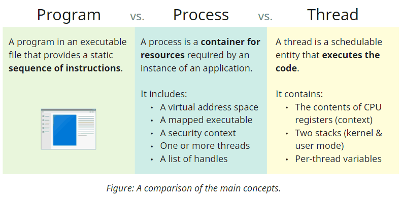
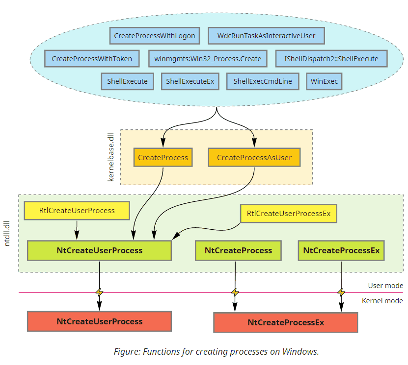
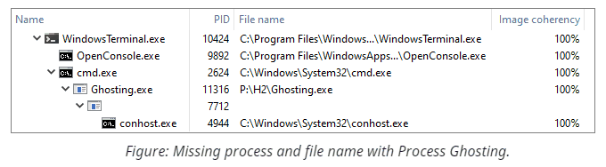

# Process Tampering

**Process Tampering** is a set of techniques that exploit various intricate aspects of the operating system's functioning to violate assumptions made by security software and conceal code execution on the scale of an entire process. The famous examples of such techniques include Process Hollowing, Process Doppelgänging, Process Herpaderping, and more.

## Understanding Necessary Concepts

Before diving into the technical details, let's familiarize ourselves with the main terms and concepts. First, we have **[programs](https://docs.microsoft.com/en-us/windows/win32/debug/pe-format)** - binary files that include the code and describe the dependencies it requires, such as the OS functions it needs to use. Secondly, we have **[processes](https://docs.microsoft.com/en-us/windows/win32/procthread/about-processes-and-threads)**, which represent running instances of applications. Despite commonly referring to them as *running* on the system, processes never execute any code; they are merely containers that encapsulate runtime resources such as the memory and references to actively used OS primitives. Code execution is the responsibility of one or more **[threads](https://docs.microsoft.com/en-us/windows/win32/procthread/multiple-threads)** that belong to a process and share all its resources. Technically, it is also possible to have a process with no threads under some circumstances; we will see how it comes in handy for some techniques later.

Every process includes a [private virtual address space](https://docs.microsoft.com/en-us/windows/win32/memory/virtual-address-space) that encompasses all addressable memory. It contains regions with different [memory protection](https://docs.microsoft.com/en-us/windows/win32/memory/memory-protection-constants) (read/write/execute) and purposes (storing data or code). We will discuss the initial memory layout for newly created processes shortly.

## How A Process Is Born

Windows includes multiple ways to start processes, ranging from high-level Shell API that only asks for a filename to low-level Native API that might require manually parsing the binary and creating the initial thread. But despite this diversity, everything boils down to two system calls.

All officially documented functions eventually end up either in **[`CreateProcess`](https://docs.microsoft.com/en-us/windows/win32/api/processthreadsapi/nf-processthreadsapi-createprocessw)** or **[`CreateProcessAsUser`](https://docs.microsoft.com/en-us/windows/win32/api/processthreadsapi/nf-processthreadsapi-createprocessasuserw)**. Some higher-level APIs call them directly; others require COM/RPC to forward the request to a dedicated OS component (such as [AppInfo](https://docs.microsoft.com/en-us/windows/win32/secauthz/user-account-control), [WMI](https://docs.microsoft.com/en-us/windows/win32/wmisdk/about-wmi), [Secondary Logon](https://docs.microsoft.com/en-us/windows/win32/api/winbase/nf-winbase-createprocesswithlogonw) services, or even [Windows Explorer](https://docs.microsoft.com/en-us/windows/win32/shell/ishelldispatch)) that invokes these functions on the caller's behalf.

While `CreateProcess` is quite a complex function by itself, most of the logic we are interested in is implemented inside the underlying **[`NtCreateUserProcess`](https://github.com/processhacker/phnt/blob/190fbb00f1d3f541441ee0bc6f220ee9eff5e64a/ntpsapi.h#L1857-L1872)** syscall. Nonetheless, aside from relying on the Native API structures and being designed accordingly, `NtCreateUserProcess` is similar to `CreateProcess`. The function takes a filename, some [parameters](https://github.com/processhacker/phnt/blob/190fbb00f1d3f541441ee0bc6f220ee9eff5e64a/ntrtl.h#L2536-L2583), and an array of [attributes](https://github.com/processhacker/phnt/blob/190fbb00f1d3f541441ee0bc6f220ee9eff5e64a/ntpsapi.h#L1556-L1586) on input and produces a ready-to-run process with the initial thread created for us on output. Let's take a closer look at the main structures we can find in the address space of a newly created process:

Initially, every process has only two executable images mapped into its address space: the program itself and ntdll.dll (the base library that exposes Native API to user-mode code).

> Technically, there is an exception to this rule: 32-bit applications running under [WoW64](https://docs.microsoft.com/en-us/windows/win32/winprog64/wow64-implementation-details) emulation on 64-bit systems additionally get a 32-bit ntdll.

Other dependencies (kernel32.dll, shell32.dll, etc.) get loaded later on demand by the initial thread when the module loader (implemented in ntdll) starts resolving the program's dependencies. Aside from the executable code, you will also find these several fundamental structures in every process:

1. **[`PEB`](https://github.com/processhacker/phnt/blob/190fbb00f1d3f541441ee0bc6f220ee9eff5e64a/ntpebteb.h#L69-L230)**, or **Process Environment Block** is a memory region that stores and cross-references internal process-wide information, including process parameters, heaps, and the list of loaded modules.
2. **[`RTL_USER_PROCESS_PARAMETERS`](https://github.com/processhacker/phnt/blob/190fbb00f1d3f541441ee0bc6f220ee9eff5e64a/ntrtl.h#L2536-L2583)** - a structure that controls the command-line arguments, environment variables, appearance settings, and other configuration options. `CreateProcess` constructs most of its fields from [`STARTUPINFO`](https://docs.microsoft.com/en-us/windows/win32/api/processthreadsapi/ns-processthreadsapi-startupinfow), hence the similarity.
3. **[`TEB`](https://github.com/processhacker/phnt/blob/190fbb00f1d3f541441ee0bc6f220ee9eff5e64a/ntpebteb.h#L266-L437)**, or **Thread Environment Block** is another essential data structure that stores virtually all per-thread configuration. Several well-known functions like [`GetCurrentProcessId`](https://docs.microsoft.com/en-us/windows/win32/api/processthreadsapi/nf-processthreadsapi-getcurrentprocessid), [`GetCurrentThreadId`](https://docs.microsoft.com/en-us/windows/win32/api/processthreadsapi/nf-processthreadsapi-getcurrentthreadid), and [`GetLastError`](https://docs.microsoft.com/en-us/windows/win32/api/errhandlingapi/nf-errhandlingapi-getlasterror) retrieve information from the corresponding fields in TEB.
4. **[Thread Stack](https://docs.microsoft.com/en-us/windows/win32/procthread/thread-stack-size)** - a dedicated area for storing call hierarchy and local variables on a per-thread basis.
5. Other structures that are less relevant for our discussion and, thus, not shown on the diagram - [ApiSetMap](https://docs.microsoft.com/en-us/windows/win32/apiindex/windows-apisets), [USER_SHARED_DATA](https://geoffchappell.com/studies/windows/km/ntoskrnl/inc/api/ntexapi_x/kuser_shared_data/index.htm), etc.

Processes created via `NtCreateUserProcess` (and, thus, `CreateProcess`, plus all higher-level functions) always include at least one thread. This thread will have a TEB and a stack somewhere within the address space.

## Going Deeper

Process creation we've seen so far isn't inherently complex (from the programmer's perspective) because `NtCreateUserProcess` is a relatively recent addition introduced to simplify it. Before Windows Vista, however, `CreateProcess` used to rely on a different syscall - **[`NtCreateProcessEx`](https://github.com/processhacker/phnt/blob/190fbb00f1d3f541441ee0bc6f220ee9eff5e64a/ntpsapi.h#L1205-L1218)**. This legacy function is still available in modern versions of Windows, so let's take a look at a small comparison of their functionality:

Property                                             | NtCreateUserProcess     | NtCreateProcessEx
---------------------------------------------------- | ----------------------- | -----------------
Means to specify the executable:                     | Filename (in NT format) | Handle to an image section
Prepares `RTL_USER_PROCESS_PARAMETERS`?              | Yes                     | No
Creates the initial thread?                          | Yes                     | No
Immediately notifies drivers about process creation? | Yes                     | No

The first and foremost difference between these syscalls is that `NtCreateProcessEx` does the bare minimum compared to `NtCreateUserProcess`. Not only does it create a process with no threads, but it also doesn't even allocate `RTL_USER_PROCESS_PARAMETERS` nor understand filenames.

As a result, dealing with this function is significantly more cumbersome because of all the additional operations it requires. Here is a rough recipe of how to re-implement the modern `NtCreateUserProcess` using the legacy `NtCreateProcessEx`:

1. Open the executable file for the new process. `NtCreateProcessEx` doesn't understand filenames, so the first step in the preparation is to call [`NtOpenFile`](https://docs.microsoft.com/en-us/windows/win32/api/winternl/nf-winternl-ntopenfile).

2. Create an image section (aka [file mapping](https://docs.microsoft.com/en-us/windows/win32/memory/file-mapping)) object from it. In terms of Native API, it requires calling [`NtCreateSection`](https://docs.microsoft.com/en-us/windows-hardware/drivers/ddi/ntifs/nf-ntifs-ntcreatesection) with the `SEC_IMAGE` flag and the handle from the previous step.

3. Create the process object using `NtCreateProcessEx`. The new process will still get a mapped copy of the executable, ntdll, and PEB in its address space, but that's about it.

4. Allocate and copy process parameters block into the target. The simplest way is to use the [`RtlCreateProcessParameters`](https://github.com/processhacker/phnt/blob/190fbb00f1d3f541441ee0bc6f220ee9eff5e64a/ntrtl.h#L2598-L2612) helper locally and then transfer the resulting structure into the new process via [`NtAllocateVirtualMemory`](https://github.com/processhacker/phnt/blob/190fbb00f1d3f541441ee0bc6f220ee9eff5e64a/ntmmapi.h#L509-L519) and [`NtWriteVirtualMemory`](https://github.com/processhacker/phnt/blob/190fbb00f1d3f541441ee0bc6f220ee9eff5e64a/ntmmapi.h#L557-L566). Remember that since process parameters contain pointers, they need to be adjusted correspondingly to be valid within the target.

5. Adjust the corresponding process parameters pointer in the target's PEB using `NtWriteVirtualMemory`.

6. Map the section locally for parsing; determine its entry point address and stack parameters for the initial thread. It might be tempting to query `ProcessImageInformation` via [`NtQueryInformationProcess`](https://github.com/processhacker/phnt/blob/190fbb00f1d3f541441ee0bc6f220ee9eff5e64a/ntpsapi.h#L1271-L1280) instead, but, unfortunately, this approach does not account for [mandatory ASLR](https://docs.microsoft.com/en-us/microsoft-365/security/defender-endpoint/exploit-protection-reference#force-randomization-for-images-mandatory-aslr) under some conditions. The most reliable way is to manually parse the [PE headers](https://docs.microsoft.com/en-us/windows/win32/debug/pe-format).

7. Create the initial thread. Previously, this step would require manually preparing TEB and allocating the stack, but luckily, nowadays, we can let [`NtCreateThreadEx`](https://github.com/processhacker/phnt/blob/190fbb00f1d3f541441ee0bc6f220ee9eff5e64a/ntpsapi.h#L1886-L1901) do everything for us.

Anyway, as for the technical details, a carefully written implementation is always available for review in this repository. Still, you might wonder why anybody would use this overly-engineered approach. Here are a few key points:

 - An explicit gap between opening and mapping the executable allows tampering with its content.
 - The associated file for the image section can already seize from existence when we create the process.
 - Security software that subscribes to synchronous process creation notifications only receives a heads-up during the creation of the initial thread. Thus, new processes with no threads are essentially invisible to security software.

## Tampering With The Identity

Mechanisms that enforce security policy always need some contextual information about the caller. Windows kernel usually relies on *access tokens* in its security-related decision-making because these objects allow attributing activity to a particular user and determining their privileges. In some cases, however, various components also heavily depend on recognizing the **identity of the process** that attempts to perform a specific operation. For instance, per-application firewall rules and application control policies like [AppLocker](https://docs.microsoft.com/en-us/windows/security/threat-protection/windows-defender-application-control/applocker/applocker-overview) and [Software Restriction Policies](https://docs.microsoft.com/en-us/windows-server/identity/software-restriction-policies/software-restriction-policies) cannot function without the underlying mechanisms for process identification. But probably the most impactful example is anti-malware detection logic used by AV and EDR software, which often behaves differently based on the process to which it's applied. These differences can take a form ranging from as simple as explicit exceptions from the rules to reputation-based multipliers. Faking process identity can be a powerful tool in the hands of an attacker, allowing to defeat entire families of security mechanisms at once.

### The Name Mismatch

The name and path to the executable are the primary pieces of identifying information about a process. The filenames are easy to work with; plus, knowing them allows further inspecting the application's files, computing hashes, verifying digital signatures, and much more. On the low level, however, the connection between the process and the file on the disk is not as straightforward as it might seem. There are several ways of retrieving the filename which might yield contradicting results. Some methods might provide outdated information, others can fail to query it after targeted tampering, and a few can even show arbitrary values of the attacker's choice. You can find a detailed overview of these methods in the [detection write-up](../Detection), where we will hunt for a mismatch between these values to uncover the use of process tampering.

Here are a few tricks and techniques that can introduce a name mismatch or otherwise confuse software that relies on retrieving filenames for processes, all without changing the content of the files:

 - **Renaming**. It might sound silly, but in some overly-simplified attack scenarios, it might be enough to rename the file before and after spawning the process from it. Of course, it won't fool security software that scans the executable synchronously with process creation, but it might circumvent mechanisms that check the filename later on demand. Such checks include looking up the short name from the process snapshot, querying the Native process image name, or reading it from the target's memory. Additionally to renaming, the attacker might also plant a different file under the previously used path, further increasing confusion when a human inspection is involved. Aside from using APIs that show outdated information, many tools (Task Manager, for example) cache filenames and, therefore, become unable to navigate to the correct executable after renaming.
 - **Deleting**. Deleting running executables is often considered impossible because the system locks files mapped into memory. There is, however, an edge case in the rules ([discovered by Jonas Lyk](https://twitter.com/jonasLyk/status/1350401461985955840)) that allows doing so on NTFS volumes due to the logic behind [alternative stream](https://docs.microsoft.com/en-us/windows/win32/fileio/file-streams) handling. While the system disallows deletion and modification of the locked primary stream, it doesn't prevent its renaming to an alternative stream. Because files must always have the primary (`::$DATA`) stream, moving the content into an alternative stream creates an unlocked primary stream. Deleting this new stream, by definition, deletes the entire file and bypasses the lock on the alternative stream. At this point, every API that tracks renames starts returning errors because the active link between the process and the file is gone. The attacker might want to re-create the file and exploit the filename caching issues discussed above, but it won't restore the connection to the original process.
 - [**Unlocking the executable**](0.UnlockExe). The previous item prevents security software from using rename-tracking APIs to locate the executable later during the process's lifetime, but it sacrifices the file we might want to keep. Instead of deleting it, we can duplicate the original stream, move the locked stream out of the way, delete it, and then replace the newly unlocked empty primary stream with the duplicate. As a result, the file effectively remains unchanged but becomes available for modification. Of course, the subsequent changes to the content do not affect the existing memory mappings that become **disassociated** from the underlying file. The functions that retrieve the identity of the process and track renames also start to fail for a similar reason. Note that this stream rotation trick is superior to deleting and re-creating the file because it preserves all of its attributes, the file ID, hard links, and other properties. The [**UnlockExe**](0.UnlockExe) tool included with this repository implements this original technique.
 - [**Process Ghosting**](1.Ghosting). The previous techniques might bypass some functions, but they fail to completely hide the filename because of the information that the system captures during process creation. Additionally, many security products opt-in to verifying the file synchronously, i.e., before we can tamper with its name. That's where the architectural decisions of `NtCreateProcess` come into play and benefit attackers. This syscall uses section objects (aka. memory mappings) which, as we know from the discussions above, can lose their association with the files on disk, effectively anonymizing it. When it happens, the system cannot query the name and establish the identity of the new process from the start of its existence, leading to some peculiar results. The most noticeable effect is the empty string that the system uses for the short image name in the process snapshot. Other identification methods either fail or return NULL. Notably, the caller still needs to provide some filename in the `ImagePathName` field of `RTL_USER_PROCESS_PARAMETERS`, but this string can point to an arbitrary file of choice.    
    The classical implementation of Process Ghosting works as follows: it creates a temporary file, marks it for pending deletion, creates an image section from it, closes the file (initiating deletion), and then creates a process from it. The [demo](1.Ghosting) provided with this repository follows the same logic. It is also possible to avoid using a temporary file and implement this technique utilizing the filename dissociation trick from the previous example (the UnlockExe demo); we leave this task as an exercise to the reader.
    

- [**Process Hollowing**](2.Hollowing). The process's identity is tight to the executable file used during its creation, not the *content of the memory*. And while there is a connection between those two concepts at the beginning of the process's lifetime, subsequent changes might invalidate this correlation. Process Hollowing exploits this subtle difference: it converts a trusted process into an empty husk and then uses it to execute a different binary. At the bare minimum, this technique spawns a new suspended process, maps the payload in its address space, adjusts the image base address in the Process Environment Block, changes the start address of the initial thread, and then resumes the target's execution. After the execution starts, the code in ntdll proceeds with the same initialization sequence as usual: it retrieves the image base address from PEB, resolves the imports for the module located there, and jumps to the provided entry point address. Because this type of tampering preserves the connection with the original file and happens **after the system notifies the security software**, products that don't inspect the memory (or at least its layout and properties) have a hard time detecting this technique. Due to its simplicity, the absence of file I/O, and small compatibility impact, Process Hollowing becomes a more formidable option than the previously discussed approaches. We cover this technique in the name mismatch category (and not the content mismatch discussed in the [upcoming section](#the-content-mismatch)) because it doesn't modify any files or code and always introduces a mismatch between the filename used during creation and the file mapped at the image base. Notably, existing implementations deviate in how they map the payload: using an image section that mimics the type of memory used for legitimate purposes or a private executable region where the attacker needs to copy the PE file according to its layout. The [demo implementation](2.Hollowing) provided with this repository uses the former approach, but keep in mind that both options are viable and have pros and cons.

### The Content Mismatch

One of the core features in Windows that links memory management and file I/O is the ability to [project files](https://docs.microsoft.com/en-us/windows/win32/memory/creating-a-file-view) into an address space of a specific process. Aside from offering a remarkably convenient and optimized instrument for [accessing data](https://docs.microsoft.com/en-us/windows/win32/memory/reading-and-writing-from-a-file-view) on the disk via mere memory operations, it also powers several other fundamental primitives, including the one that provides processes with most of their executable memory. Typically, Memory Manager keeps all file projections in sync with the backing storage. However, it also supports the [copy-on-write](https://docs.microsoft.com/en-us/windows/win32/memory/memory-protection-constants) semantics where multiple views derived from the same source can have different content because all modifications remain local. The images that process creation and DLL loading operations map into processes also utilize this mode, allowing them to combine the best of both worlds. Sharing memory by default drastically reduces its footprint, while making a private copy on any modification guarantees adequate isolation and sustains stability.

Having a private copy implies that the attacker that modifies mapped image memory doesn't leave any traces for security software that only looks into the files that stay untouched. However, such techniques generally fall into the category of code injection. What process tampering can offer is a bit more exotic because it originates from the opposite direction and describes what happens if we somehow manage to alter the underlying executable file. The answer might initially sound dull - the memory doesn't change, but it opens up the possibility of introducing content mismatch without ever modifying memory.

 - **[Process Doppelgänging](3.Doppelganging)**. This technique uses an [elegant approach](https://www.blackhat.com/docs/eu-17/materials/eu-17-Liberman-Lost-In-Transaction-Process-Doppelganging.pdf) that relies on the [transactional filesystem](https://docs.microsoft.com/en-us/windows/win32/fileio/transactional-ntfs-portal) (TxF). Transactions group I/O operations, providing a few convenient guarantees such as atomicity, consistency, isolation, and durability (see [ACID](https://en.wikipedia.org/wiki/ACID)). Because of the [isolation](https://docs.microsoft.com/en-us/windows/win32/fileio/txf-basic-concepts), transactions effectively become a mechanism that allows a file to be in two states simultaneously. When we modify files in place, these two alternative views might share the filename and disagree on the content. This ambiguity also affects memory projections constructed from such files because they follow similar transactional isolation boundaries. In the end, that's what Process Doppelgänging does: it chooses an existing executable file, overwrites its content within a temporary transaction, prepares an image section from the transacted view (and, thus, containing the modified bytes), and creates a process from it. For the world outside of the transaction, the file remains untouched. Therefore, when a naïve security product observes the process creation event, it looks up the corresponding file, opens it outside the transaction, verifies the initial content, and doesn't raise the alarm. At the same time, the target's address space holds an altered version that merely hides inside the transaction under the same filename.    
    Interestingly, the original implementation rolls the transaction back immediately after creating the initial thread. This operation has a similar effect to deleting the underlying file since it disassociates the filename from the section object. Hence, it introduces artifacts that can give away the use of this technique to forensic detection tools. Of course, it happens after most anti-malware services inspect the process during its creation, but still. The [demo](3.Doppelganging) provided with this repository supports the classical and a revisited approach that keeps the transaction alive for the entire process's lifetime. Comparing how these two alternatives behave against various detections is left as an exercise to the reader.

 - **[Process Herpaderping](4.Herpaderping)**. This [relatively recent technique](https://jxy-s.github.io/herpaderping) utilizes a simple yet effective alternative solution for achieving a file content mismatch. Because `NtCreateProcess` requires the caller to open the executable file manually, we can use this opportunity to request write access to the file - something that becomes impossible because of the locking rules once we create the section object. After obtaining this handle, we can backup the original file content and overwrite it with the payload. Then we prepare the image section (which reads and caches our payload) and restore the file's content to its original state. Despite the rollback, the section object remains using the payload data. Finally, we close the file and proceed with the typical low-level process creation (using the altered section object). Notably, because we never delete the file or revert transactions, the section (and, therefore, the process) never loses association with the original file. Even security products aware of Process Doppelgänging won't notice anything suspicious about the new process unless they perform a full comparison of the code in memory to the data on the disk. As with other techniques, you'll find the demo implementation [in the corresponding folder](4.Herpaderping).

## Conclusion

Concealing code execution on the scale of an entire process is an advanced approach for evading security software. Thus, detecting process tampering is a peculiar subject, notable for requiring specially designed tools that pay attention to detail. You can find more information on this topic in the corresponding [section of the project](../Detection).

## Further Reading

Here you can find more quality material from other authors on the topic:
 - [Process Herpaderping](https://jxy-s.github.io/herpaderping) paper by Johnny Shaw.
 - [Lost in Transaction: Process Doppelgänging](https://www.blackhat.com/docs/eu-17/materials/eu-17-Liberman-Lost-In-Transaction-Process-Doppelganging.pdf) - the original slides from Black Hat 2017 by Tal Liberman and Eugene Kogan.
